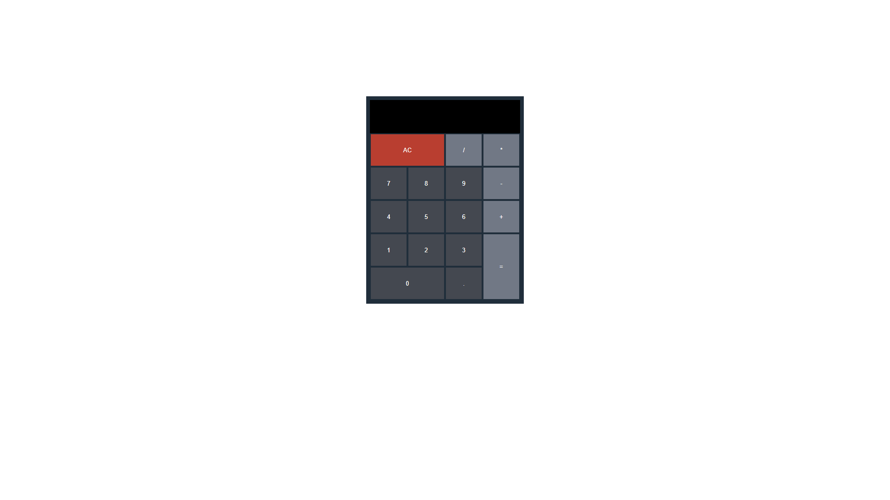

<h1 align="center">
   Calculadora
</h1>

## 
 <u>Preview da página:</u> 

  

> A página possui uma calculadora minimalista

<h4 align="center"><a href="https://tahaluh.github.io/calculator-react/" target="_blank">Clique para visitar o projeto</a></h4>

---
# 💼 Tecnologias Utilizadas

As seguintes ferramentas foram usadas na construção do projeto:

- Html
- Css
- ReactJS

*Também foram aplicados conceitos de responsividade*

# ⚙️ Instalação

### Client

  1. `$ cd client`
  2. `$ npm install`
  3. `$ npm start`

# 🛠️ Funcionalidades

- Realizar cálculos matemáticos (soma, subtração, multiplicação e divisão)
- Utilizar números flutuantes para cálculos

---

### Ajustes e melhorias

O projeto ainda está em desenvolvimento e as próximas atualizações serão voltadas nas seguintes tarefas:

- [ ] Adição de ferramentas de calculadora científica, com novas funções

---

Feito por Thauã Magalhães 👋🏽 Entre em contato!

 

